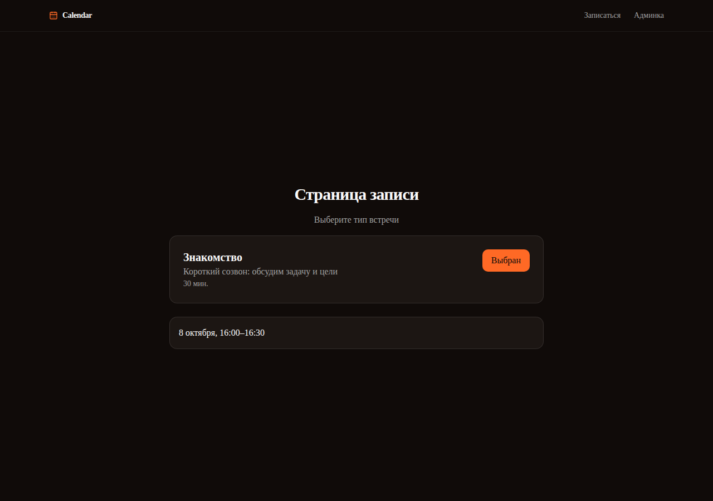
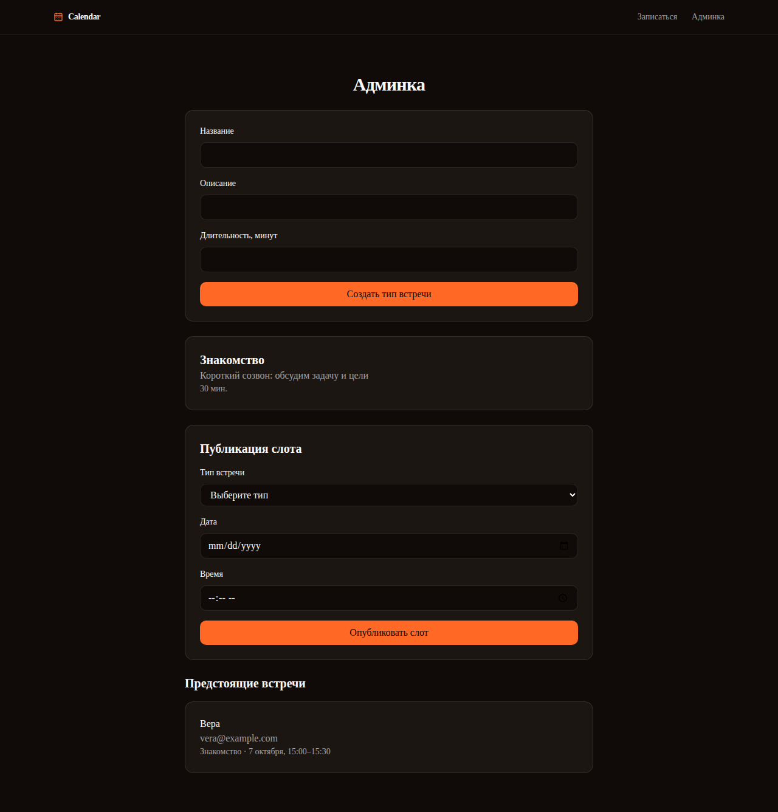

# Календарь звонков


[](https://github.com/TimG9v/ai-for-developers-project-387/actions)

Сервис записи на звонки по мотивам Cal.com: владелец календаря публикует
свободные слоты, гость выбирает слот и записывается на 30-минутный звонок —
без регистрации.

Учебный проект Хекслета: https://ru.hexlet.io/programs/ai-for-developers
Как это должно работать: https://files.hexlet.app/a/2ipc5m

## Публичный деплой

**https://calendar-387.onrender.com** — Render, бесплатный план. Две
особенности бесплатного инстанса:

- после ~15 минут простоя первый запрос отвечает с задержкой на холодный
  старт (десятки секунд);
- данные хранятся в памяти процесса — ре-деплой или рестарт контейнера
  обнуляет типы встреч, слоты и записи.

Страница записи — выбор типа встречи и подтверждение записи:



Страница владельца — создание типов, публикация слотов, предстоящие встречи:



## Стек

- **Backend**: Rust, axum, in-memory-хранилище (без БД)
- **Frontend**: Next.js 16 (App Router, TypeScript, Tailwind, shadcn/ui)
- **Контракт**: TypeSpec → OpenAPI → генерация клиентского SDK (hey-api) и
  серверных типов (typify)
- **Деплой**: один Docker-контейнер, Render

## Установка

```bash
git clone https://github.com/TimG9v/ai-for-developers-project-387.git
cd ai-for-developers-project-387
```

Локальный запуск без Docker (нужны Rust и Node из `.tool-versions`/`.nvmrc`):

```bash
make dev     # backend на :8081, frontend на :3000
make stop    # остановить оба
```

## Docker

Образ поднимает оба процесса сам: backend на внутреннем `127.0.0.1:8081`
(переменная `BACKEND_PORT`), frontend — на порту из переменной `PORT`
(именно её передаёт платформа и автопроверка):

```bash
docker build -t calendar .
docker run -e PORT=8080 -p 8080:8080 calendar
```

После запуска: `http://127.0.0.1:8080` — главная, `/booking` — страница
записи, `/admin` — страница владельца, `/health` — статус.

Контейнер стартует с демо-данными: два типа встреч и слоты на ближайшие
3 дня (10:00 и 15:00 UTC, 30-минутная сетка). Демо-данные отключаются
переменной окружения `BACKEND_SEED_DEMO=0`; хранилище in-memory, после
перезапуска данные и демо-набор создаются заново.

## Как устроено

Страницы:

| Путь               | Что это                                                                    |
| ------------------ | -------------------------------------------------------------------------- |
| `/`                | главная — про сервис и переход на страницу записи                          |
| `/booking`         | страница записи: гость выбирает тип встречи, слот и записывается           |
| `/booking/manage`  | управление записью по ссылке из подтверждения: отмена и перенос            |
| `/admin`           | страница владельца: создание типов, публикация слотов, предстоящие встречи |

API (браузер ходит через `/api/*` — same-origin, серверные компоненты —
напрямую на `BACKEND_URL`):

| Метод и путь                   | Назначение                          | Коды               |
| ------------------------------ | ----------------------------------- | ------------------ |
| `GET /health`                  | статус                              | 200                |
| `GET /event-types`             | список типов встреч                 | 200                |
| `POST /event-types`            | создать тип встречи                 | 200, 400           |
| `GET /slots`                   | свободные слоты типа (окно 14 дней) | 200                |
| `POST /slots`                  | опубликовать слот                   | 200, 400, 404      |
| `GET /bookings`                | список записей                      | 200                |
| `POST /bookings`               | записать гостя на слот              | 200, 400, 404, 409 |
| `DELETE /bookings/{id}`        | отменить запись                     | 204, 404           |
| `POST /bookings/{id}/reschedule` | перенести запись на другой слот   | 200, 400, 404, 409 |
| `GET /upcoming-meetings`       | предстоящие встречи владельца       | 200                |

Правила бронирования проверяет сервер, а не интерфейс:

- слоты принимаются только в окне 14 дней вперёд (400);
- длительность слота равна длительности его типа встречи (400 при расхождении);
- одна запись на слот — 409, повторная запись не проходит даже для другого
  типа встречи; занятый слот исчезает из календаря;
- запись на неизвестный слот — 404, без имени/email — 400;
- отмена (`DELETE`) убирает запись и освобождает слот — он снова появляется
  в календаре; несуществующая запись — 404;
- перенос — только на свободный слот того же типа встречи в окне 14 дней
  (400 при другом типе или вне окна, 409 если целевой слот уже занят);
- отменить и перенести запись гость может по ссылке управления из
  подтверждения — id записи работает как unguessable-токен
  ([АDR 0003](docs/adr/0003-manage-booking-by-link.md)); владелец делает
  то же самое кнопкой в админке.

## Разработка

```bash
make test            # cargo test + vitest
make lint            # cargo fmt/clippy + eslint
make generate        # contracts/ → openapi/ → SDK и серверные типы
```

Контракт-first: изменения API вносятся только в `contracts/main.tsp`, затем
`make generate` перегенерирует `frontend/src/client/` и серверные типы
backend'а — сгенерированное руками не правится.

Структура репозитория:

```text
backend/     crate backend: axum-роутер, in-memory-репозитории, генерируемые типы
frontend/    Next.js 16: app/ (страницы), components/ (shadcn/ui), tests/ (vitest)
contracts/   TypeSpec-контракт API (источник правды)
openapi/     сгенерированная OpenAPI-спецификация
docs/        контексты работы над задачами и агентские инструкции
```

CI — GitHub Actions на каждый push и PR: Backend CI (fmt, clippy, тесты),
Frontend CI (eslint, vitest, build), Security (cargo/npm audit), hexlet-check
(собирает Docker-образ и запускает приложение), release-please (release-PR
после мержа в `main`).

## Агентные воркфлоу

Агент OpenCode подключён через GitHub App (OIDC) и работает в четырёх
воркфлоу. Модель везде `zai-coding-plan/glm-5.3-flash`: разбор,
триаж и ревью не требуют тяжёлых рассуждений, плановая квота
провайдера делает прогоны практически бесплатными; `variant`
(уровень рассуждений) не задан. Прогоны и ответы агента смотрятся
во вкладке Actions и в комментариях к issue/PR.

| Воркфлоу           | Запуск                           | Модель                        | Назначение                             | Где смотреть прогон                          |
| ------------------ | -------------------------------- | ----------------------------- | -------------------------------------- | -------------------------------------------- |
| Backend CI         | push и PR                        | —                             | fmt, clippy, тесты backend             | Actions → Backend CI                         |
| Frontend CI        | push и PR                        | —                             | eslint, vitest, build                  | Actions → Frontend CI                        |
| Security           | push и PR                        | —                             | cargo/npm audit по lock-файлам         | Actions → Security                           |
| hexlet-check       | push                             | —                             | Docker-сборка, автотесты Хекслета      | Actions → hexlet-check                       |
| Release Please     | push в `main`                    | —                             | release-PR: changelog и semver         | Actions → Release Please                     |
| opencode           | комментарий `/oc` в issue или PR | zai-coding-plan/glm-5.3-flash | разбор задачи, фиксы и фичи по команде | Actions, ответ — комментарий в треде         |
| opencode-triage    | открыта issue (не ботом)         | zai-coding-plan/glm-5.3-flash | автотриаж: причина, путь исправления   | Actions, ответ — комментарий к issue         |
| opencode-review    | PR открыт/обновлён (не бот)      | zai-coding-plan/glm-5.3-flash | авторевью PR по правилам AGENTS.md     | Actions, ответ — комментарий к PR            |
| opencode-scheduled | cron 06:00 UTC + вручную         | zai-coding-plan/glm-5.3-flash | Lighthouse деплоя, issue по находкам   | Actions, артефакт `lighthouse-report`, issue |

### Принятые решения

- **Команда вызова одна — `/oc`** (параметр `mentions`): дефолтная
  пара `/opencode,/oc` сужена — подстрока `/opencode` встречается
  в ссылках `opencode.ai` и запускала воркфлоу на комментарии бота.
- **Звать агента могут только участники с правом записи** — условие
  `author_association` (OWNER/COLLABORATOR/MEMBER) в воркфлоу:
  посторонний `/oc`-комментарий не запускает даже прогона.
- **События от ботов отсечены** во всех воркфлоу с автором события
  (`user.type != 'Bot'`): у триажа — автор issue, у ревью — автор PR,
  у `/oc` — автор комментария. У schedule/dispatch автора нет —
  их защита: `timeout-minutes` и `concurrency`.
- **Сессии не публикуются**: `share: false` во всех четырёх воркфлоу.
  Публичный репозиторий: дефолт экшена публикует сессию с полным
  контекстом по ссылке — решение закрыто явно.
- **Права минимальны и раздельны**: интерактивный воркфлоу — только
  `id-token: write` (в репозиторий агент пишет через App-токен);
  триаж — плюс `issues: write` (комментарии); ревью — `contents: read`,
  `pull-requests: write`, `issues: read` (пишет только в PR);
  расписание — write-набор целиком: issue по находкам плюс
  output-канал экшена, который сам оформляет файлы прогона PR'ом.
- **Расход под контролем**: timeout (20–45 минут) и `concurrency` у
  воркфлоу с длинными модельными прогонами (`opencode`, `opencode-review`,
  `opencode-scheduled`); дешёвая модель; прогоны на комментариях
  без `/oc` — skipped и бесплатны.

### Самооценка работы с агентом

Закрылось с первого прохода: разбор issue по `/oc` с причиной по
коду (task-8), автотриаж новой issue по структуре prompt (task-9),
ночной Lighthouse-конвейер — артефакт и issue по находкам совпали
с сырым отчётом без галлюцинаций (task-11).

Потребовало итераций: связка модель/ключ — Zen не признал ключ
Coding Plan (4 падения AuthError, переход на `zai-coding-plan`,
PR #6); самопробуждение воркфлоу на подстроку `/opencode` в ответах
бота (лечится бот-фильтром и узким `mentions`); «тихие» зависания
прогонов (55+ минут — добавлены timeout и concurrency); формат
коммитов в агентных PR (повторная итерация с `--force-with-lease`,
task-10); конфиг release-please (три инфраструктурных починки,
task-10); сайд-эффект scheduled-прогона — PR с `report.json`
(закрыт, канал задокументирован, task-11).

## Известные ограничения

- Хранилище в памяти: данные живут до перезапуска процесса (до появления БД).
- Сетка слотов проверяется сервером в UTC: в таймзонах со смещением, не
  кратным 30 минутам (например, +05:45), локальное «:00/:30» попадает вне
  сетки — форма в такой зоне сообщит об отказе сервера.
- Авторизации нет: админ-мутации (`POST /api/event-types`, `/api/slots`)
  публично доступны — осознанный компромисс учебного демо, решение
  отслеживается в
  [issue #1](https://github.com/TimG9v/ai-for-developers-project-387/issues/1).
- Free-инстанс Render засыпает при простое (см. «Публичный деплой»).

---

<details>
<summary>Автоматические тесты Хекслета</summary>

Тесты запускаются на каждый коммит. За запуск отвечает файл `.github/workflows/hexlet-check.yml` — не удаляйте и не переименовывайте ни его, ни репозиторий.

</details>

## О Хекслете

[Хекслет](https://ru.hexlet.io/) — школа программирования: авторские программы обучения с практикой, поддержкой наставников и реальными проектами, которые остаются в резюме. Этот репозиторий — один из таких проектов.
